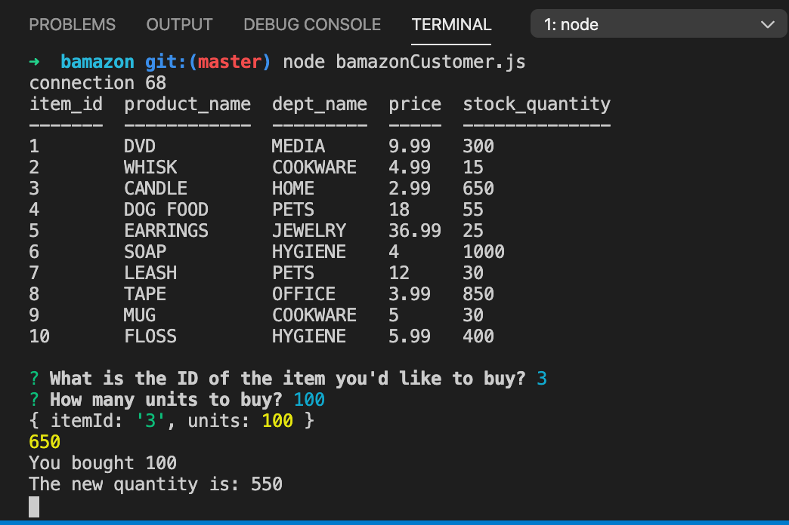
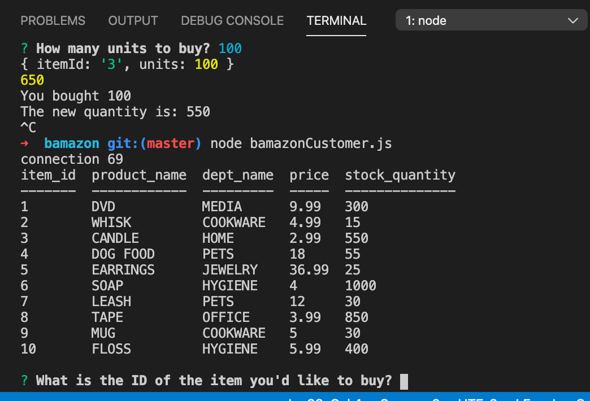

# bamazon
node and mySQL homework project

<h1>Description:</h1>

<h3>This node/mySQL application prints a table of products from a fictional server called "Bamazon" as seen in this initilization screenshot:</h3>

<h3>A user will enter the item id # of their choosing, how many of that item they would like to purchase:</h3>

<h3>and the table will then be updated with the remaining inventory.</h3>

<h3>This app utilizes the command line, Javascript, node packages/modules, and mySQL to display and perform these transactions. </h3>